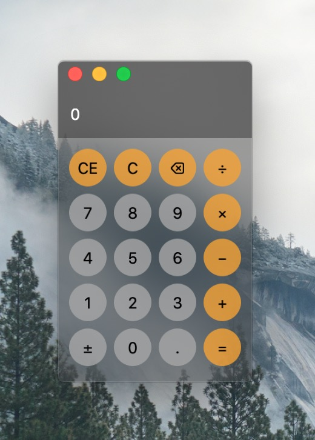

# TCW3 Calculator

A sample calculator application based on [TCW3] GUI toolkit. The calculator logic was taken from [Druid]'s [`calc.rs`] example.

[Druid]: https://github.com/xi-editor/druid
[`calc.rs`]: https://github.com/xi-editor/druid/blob/37d49a364d3baf37c06542a9f9db4b582f21e21f/druid/examples/calc.rs
[TCW3]: https://github.com/yvt/Stella2/tree/master/tcw3
